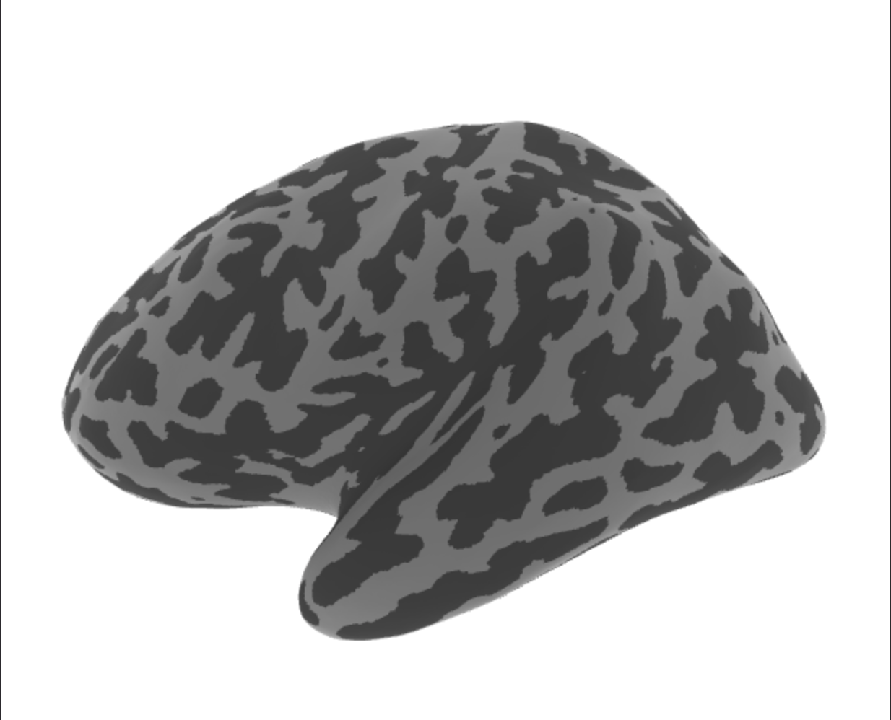
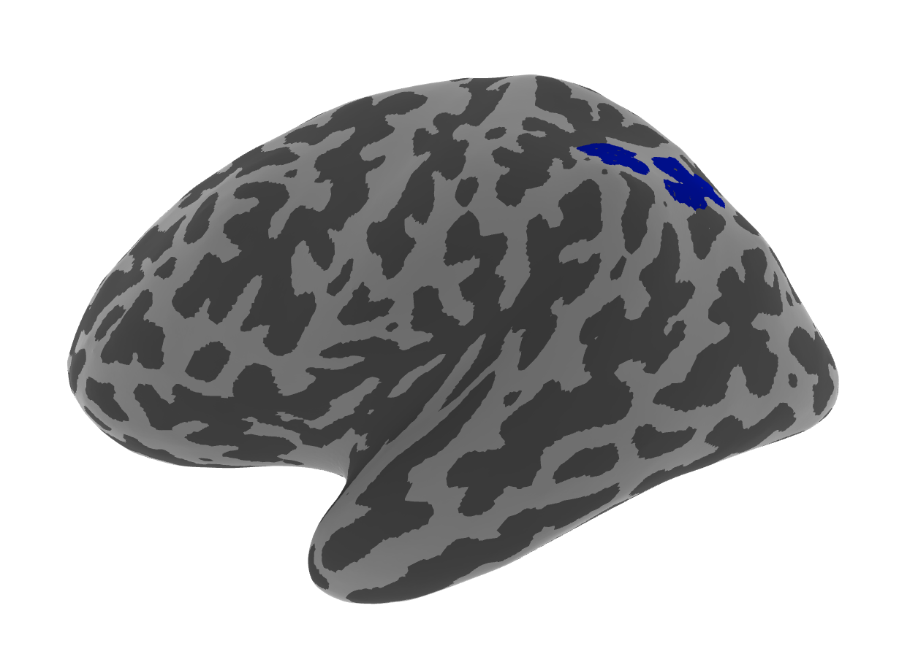

# CNL_scalpel

Scalpel is a tool for easy interaction with freesurfer cortical surface reconstructions in python

inlcuded in the repo are

- simple object-oriented design for interacting with fs subjects
- interactive plotting in jupyter
- reading, editing, and writing fs label files
- label centroids, thresholding, disjoint, boundary, depth, thickness all included
- ability to call several frequently used freesurfer functions (label2label, label2annot, mris_anatomical_stats etc.)

## Requirements
- cd to cloned github repo & create a virtual environment for CNL_scalpel `conda env create -f environment.yaml`
- `conda activate CNL_scalpel`
- Install src files in virtual environment with `pip install -e . --use-pep517` from the repo home directory
- FreeSurfer is installed locally. See installation [details](https://surfer.nmr.mgh.harvard.edu/fswiki/DownloadAndInstall)
- FREESURFER_HOME is defined and has been added to your path

## Introduction

The ScalpelSubject class provides a comprehensive set of tools for analyzing brain surface data. It is designed to work with FreeSurfer output data and provides methods for:

- Loading and visualizing brain surfaces
- Working with labels (regions of interest on the brain surface)
- Analyzing boundaries between regions
- Performing clustering of gyral regions
- Measuring sulcal depth

## Installation

Before using this code, you need to have FreeSurfer installed and set up properly. You'll also need several Python packages. These are can be installed from environment.yaml.

## Basic Usage

Let's start by creating a ScalpelSubject instance:

```python
from src.classes.subject import ScalpelSubject

# Initialize a subject
subject = ScalpelSubject(
    subject_id="subj01",       # FreeSurfer subject ID
    hemi="lh",                 # Hemisphere (lh for left, rh for right)
    subjects_dir="/path/to/subjects_dir",  # FreeSurfer subjects directory
    surface_type="inflated"    # Surface type (inflated, pial, white)
)
```

This loads the subject's cortical surface data from FreeSurfer's output directory.

## Core Properties

The ScalpelSubject class provides several properties to access the underlying data:

```python
# Basic information
print(f"Subject ID: {subject.subject_id}")
print(f"Hemisphere: {subject.hemi}")
print(f"Surface type: {subject.surface_type}")

# Surface data
vertices = subject.ras_coords  # RAS (Right-Anterior-Superior) coordinates of all vertices
faces = subject.faces          # Triangular faces of the mesh
vertex_indices = subject.vertex_indexes  # Unique vertex indices

# Anatomical data
thickness = subject.thickness  # Cortical thickness values
curv = subject.curv           # Curvature values
sulc = subject.sulc_vals      # Sulcal surface values

# Get gyrus and sulcus vertices
gyrus_vertices, gyrus_ras = subject.gyrus[0] subject.gyrus[1]
sulcus_vertices, sulcus_ras = subject.sulcus[0], subject.gyrus[1]
```

## Visualization Methods

The ScalpelSubject class provides methods for visualizing the brain surface and labels:

```python
# Plot the brain surface
subject.plot(view='lateral')  # Options: lateral, medial, dorsal, ventral

```



## Working with Labels

Labels are regions of interest on the brain surface. The ScalpelSubject class provides methods for working with labels:

```python


# Load a label from a file
subject.load_label('label_name')

# Create a custom label from vertex indices and coordinates
subject.load_label(
    'custom_label',
    label_idxs=vertex_indices,  # Array of vertex indices
    label_RAS=vertex_coordinates  # Array of RAS coordinates
)

# Access loaded labels
label_vertices = subject.labels['label_name'].vertex_indexes
label_coords = subject.labels['label_name'].ras_coords

```

Labels are loaded into a dictionary stored in ScalpelSubject['labels'], with the label name as the key. From there, labels can be combined, disjointed, thresholded, and written with single lines.

```python


```

Labels can be plotted on the interactive surfaces once loaded.

```python
subject.load_label('IPS')
subject.plot_label('IPS', face_colors = 'blue')
```



From there, it is simple to combine labels, threshold them, separate them into their disjointed components, and find their centroids. The result of manipulations can then be written to disk with the .write_label method.

```python
# Combine multiple labels
subject.combine_labels(['label1', 'label2'], 'combined_label')

# Threshold a label based on statistical values
thresholded_vertices, thresholded_coords, thresholded_stats = subject.threshold_label(
    'label_name',
    threshold=2.0,
    load_label=True,
    new_name='thresholded_label'
)

# Find the centroid of a label
centroid_vertex, centroid_coords = subject.label_centroid('label_name')

# Remove a label
subject.remove_label('label_name')

# Write a label to a file
subject.write_label('label_name')
```

## Boundary Analysis

The ScalpelSubject class provides methods for analyzing the boundaries between regions:

```python
# Perform boundary analysis on a label
analysis = subject.perform_boundary_analysis(
    'label_name',
    method='pca',             # Analysis method: 'pca' or 'direct'
    n_components=2,           # Number of PCA components
    n_clusters=[2, 3],        # Number of clusters
    clustering_algorithm='agglomerative'  # Clustering algorithm
)

# Boundary vertices
boundary_vertices = analysis['boundary']
boundary_coords = analysis['boundary_ras']

# Cluster results
clusters = analysis['cluster_results']

# Find closest clusters between two labels
analysis1 = subject.perform_boundary_analysis('label1')
analysis2 = subject.perform_boundary_analysis('label2')
closest1, closest2, min_distance = subject.find_closest_clusters(analysis1, analysis2)
```

## Gyral Clustering

The ScalpelSubject class provides methods for clustering gyral regions:

```python
# Perform gyral clustering
clusters = subject.perform_gyral_clustering(
    n_clusters=300,
    algorithm='kmeans'  # Options: 'kmeans', 'agglomerative', 'dbscan'
)

# Access cached gyral clusters
gyral_clusters = subject.gyral_clusters

# Find shared gyral clusters between two labels
shared_clusters = subject.find_shared_gyral_clusters('label1', 'label2')

# Get the shared gyral region
shared_index, shared_ras = subject.get_shared_gyral_region(shared_clusters)

# Find the gyral gap between two labels
gap_analysis = subject.find_gyral_gap('label1', 'label2')
```

## Sulcal Depth Analysis

The ScalpelSubject class provides a method for calculating the depth of a sulcus:

```python
# Calculate the sulcal depth
depth = subject.calculate_sulcal_depth(
    'sulcus_label',
    depth_pct=8,       # Percentage of deepest vertices to use
    n_deepest=100,     # Number of deepest vertices to use
    use_n_deepest=True  # If True, use n_deepest; if False, use depth_pct
)

print(f"Sulcal depth: {depth} mm")
```

## Advanced Examples

### Example 1: Comparing Two Labels

```python
# Load two labels
subject.load_label('label1')
subject.load_label('label2')

# Plot both labels
subject.plot(view='lateral', labels=['label1', 'label2'])

# Find the gyral gap between them
gap_analysis = subject.find_gyral_gap('label1', 'label2')

# Create a new label for the shared gyral region
subject.load_label(
    'shared_gyral_region',
    label_idxs=gap_analysis['shared_gyral_index'],
    label_RAS=gap_analysis['shared_gyral_ras']
)

# Plot the shared gyral region
subject.plot_label('shared_gyral_region', view='lateral')
```

### Example 2: Sulcal Depth Analysis

```python
# Load a sulcus label
subject.load_label('sulcus_label')

# Calculate the sulcal depth
depth = subject.calculate_sulcal_depth('sulcus_label')
print(f"Sulcal depth: {depth} mm")

# Threshold the label based on sulcal depth
subject.threshold_label('sulcus_label', threshold=depth*0.8, load_label=True, new_name='deep_sulcus')

# Plot the deep sulcus label
subject.plot_label('deep_sulcus', view='lateral')
```

### Example 3: Complete Analysis Workflow

```python
# Initialize a subject
subject = ScalpelSubject("subj01", "lh", "/path/to/subjects_dir", "inflated")

# Load labels
subject.load_label('label1')
subject.load_label('label2')

# Plot the labels
subject.plot(view='lateral', labels=['label1', 'label2'])

# Find the centroids
centroid1, coords1 = subject.label_centroid('label1')
centroid2, coords2 = subject.label_centroid('label2')

# Calculate the distance between centroids
distance = np.linalg.norm(coords1 - coords2)
print(f"Distance between centroids: {distance} mm")

# Find the gyral gap
gap_analysis = subject.find_gyral_gap('label1', 'label2')

# Create a new label for the shared gyral region
subject.load_label(
    'shared_gyral_region',
    label_idxs=gap_analysis['shared_gyral_index'],
    label_RAS=gap_analysis['shared_gyral_ras']
)

# Calculate the sulcal depth if the shared region is a sulcus
if len(gap_analysis['shared_gyral_index']) > 0:
    depth = subject.calculate_sulcal_depth('shared_gyral_region')
    print(f"Sulcal depth of shared region: {depth} mm")

# Plot the final result
subject.plot(view='lateral', labels=['label1', 'label2', 'shared_gyral_region'])
subject.show()
```

This tutorial provides an overview of the main functionality of the ScalpelSubject class. The class provides powerful tools for analyzing brain surface data, particularly for studying the relationship between different regions of the brain.
