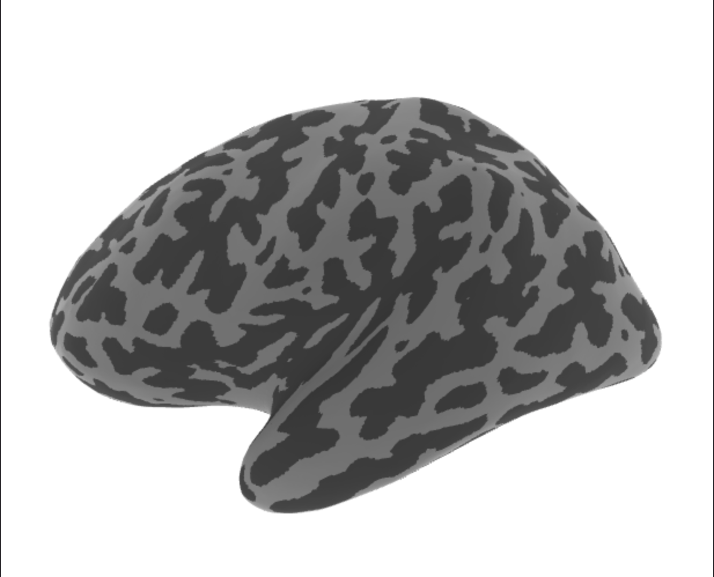
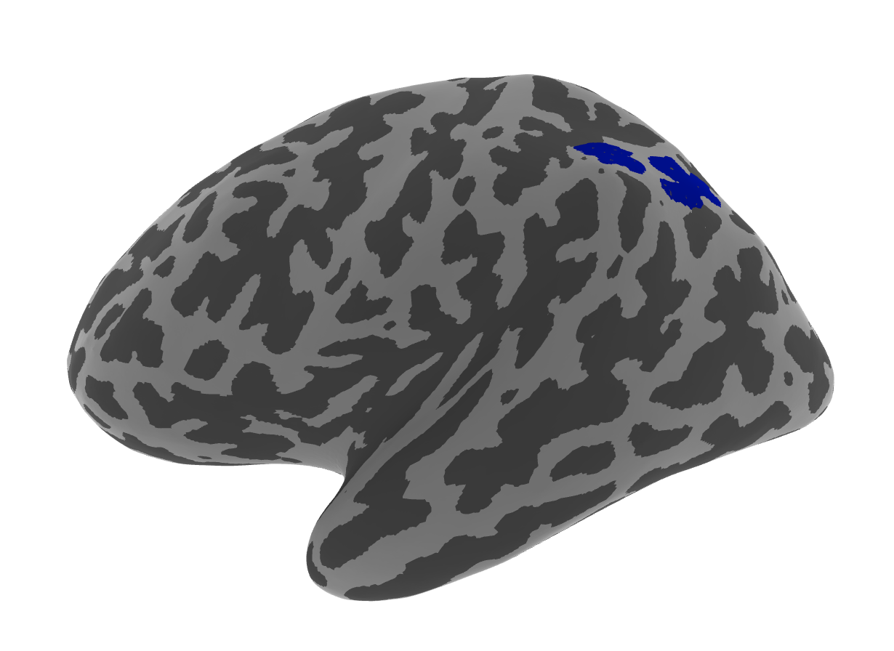

# CNL_scalpel

Scalpel is a Python library for analysis, segmentation, and plotting of FreeSurfer cortical surface reconstructions. It wraps a subject's surfaces, curvature, and label files behind a single object and provides tools for visualization, morphometry, distance measurement, and gyral-sulcal analysis.

## Capabilities

**Surface & subject handling**
- Object-oriented access to a FreeSurfer subject's surfaces (white, pial, inflated, gyral-inflated), curvature, sulcal depth, thickness, and local gyrification maps
- Access to RAS vertex coordinates, mesh faces, cortex vertices, and the surface adjacency matrix
- Reading, editing, combining, and writing FreeSurfer label files

**Visualization**
- Interactive 3D surface plotting in Jupyter notebooks
- Standard anatomical views: lateral, medial, dorsal, ventral
- Plot one or many labels with custom colors, overlay geodesic paths, and export figures to disk

**Measurement (morphometry)**
- Surface area, gray matter volume, and mean/std cortical thickness per label
- Sulcal depth from the deepest vertices of a sulcal label
- Absolute curvature, curvature indices, and local gyrification index (lGI)
- Batch export of FreeSurfer-style stats and arbitrary measurements to CSV

**Distances & paths**
- Euclidean distance between labels (centroid, nearest, or farthest)
- Exact geodesic (on-surface) distance via the MMP algorithm, restricted to the cortex by default
- Ordered geodesic paths between labels for tracing routes across the surface
- Label overlap metrics: Dice, Jaccard, overlap coefficient, intersection/union size

**Gyral-sulcal analysis**
- Gyral clustering (k-means, agglomerative, DBSCAN)
- Boundary analysis and detection of shared gyral regions between labels
- Gyral-gap analysis between adjacent labels
- Comprehensive sulcal-gyral relationship analysis (anterior/posterior gyri, adjacency mapping)
- Label thresholding by percentile or absolute value on curvature, thickness, sulcal depth, or custom stats
- Extraction of the deepest sulci and label centroids as new labels

## Architecture

`ScalpelSubject` is the main entry point. It loads the subject's surface data and delegates specialized work to three components:

- **ScalpelVisualizer** — visualization and plotting
- **ScalpelMeasurer** — morphometric measurements, distances, and paths
- **ScalpelAnalyzer** — clustering, boundary, and gyral-sulcal analysis

This keeps a simple, consistent user interface while organizing functionality logically. Most methods are also exposed directly on `ScalpelSubject` for convenience.

## Visualization examples

Lateral view of an inflated surface:



A label (IPS) plotted on the lateral surface:



## Installation

### Requirements

- Python 3.10 or higher
- FreeSurfer installed locally ([installation guide](https://surfer.nmr.mgh.harvard.edu/fswiki/DownloadAndInstall))
- `FREESURFER_HOME` environment variable defined and on your `PATH`

### Setup

```bash
git clone https://github.com/b-parker/CNL_scalpel.git
cd CNL_scalpel

conda create --name CNL_scalpel python=3.10
conda activate CNL_scalpel

pip install -e .
```

## Quick Start

```python
from scalpel.subject import ScalpelSubject

subject = ScalpelSubject(
    subject_id="subj01",
    hemi="lh",
    subjects_dir="/path/to/subjects_dir",
    surface_type="inflated",
)

subject.load_label("precentral")
subject.plot(view="lateral", labels=["precentral"])
subject.show()
```

## Tutorials

For full, runnable examples of every capability above, see the notebooks in `notebooks/`:

- `tutorial.ipynb` — end-to-end walkthrough of loading subjects, plotting, measurement, and gyral-sulcal analysis

## Contributing

Contributions are welcome! Please feel free to submit a Pull Request.

## License

This project is licensed under the MIT License — see the LICENSE file for details.
